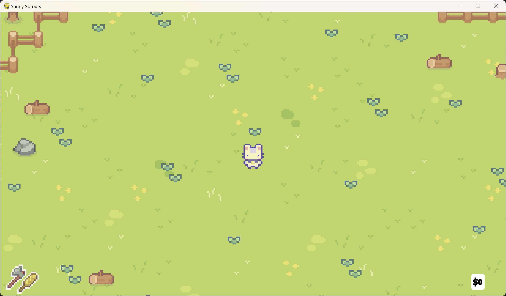
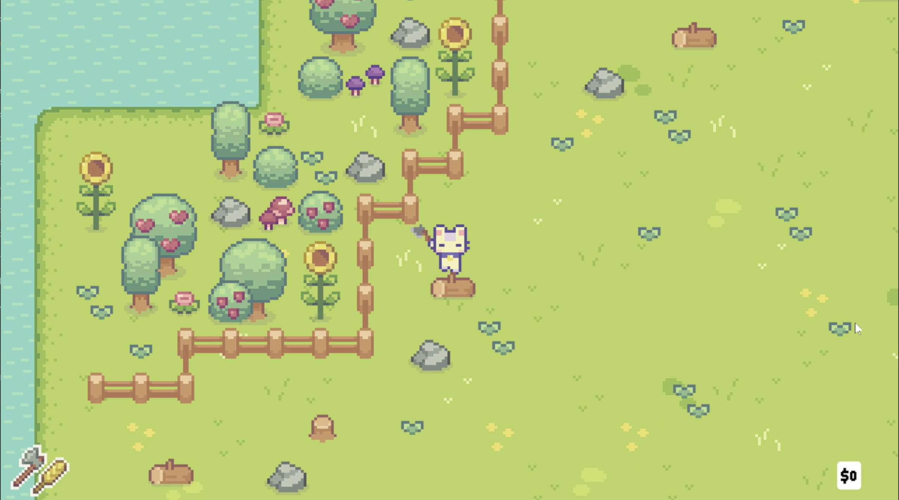
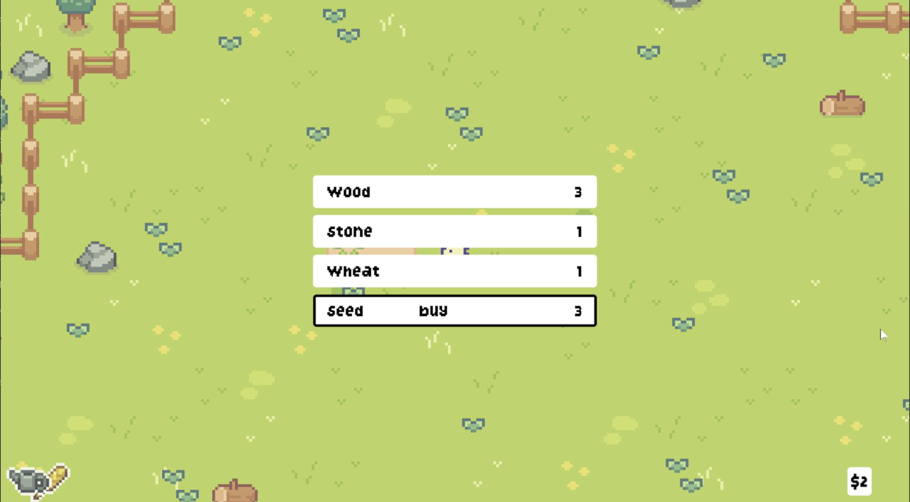
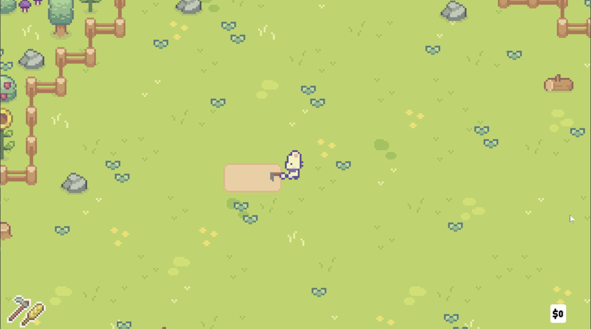
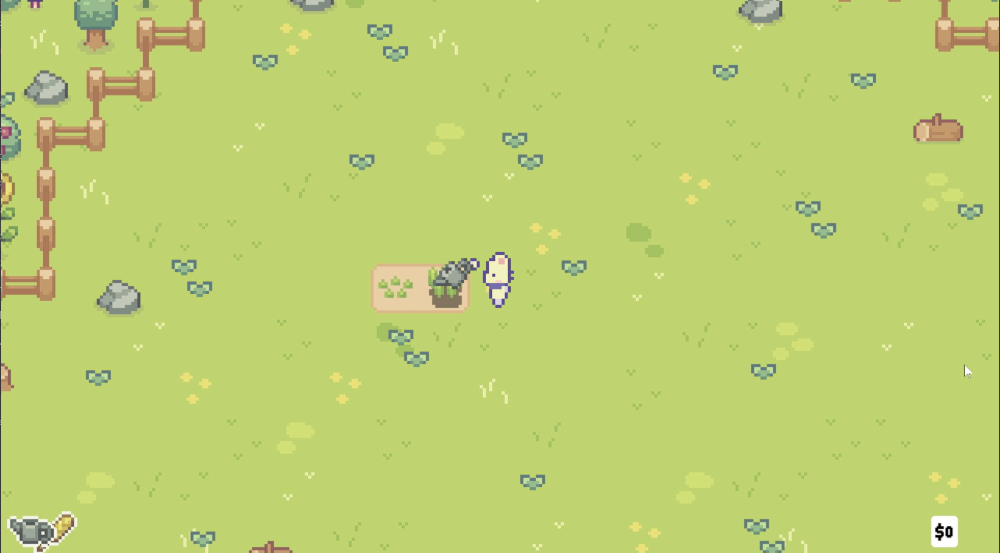
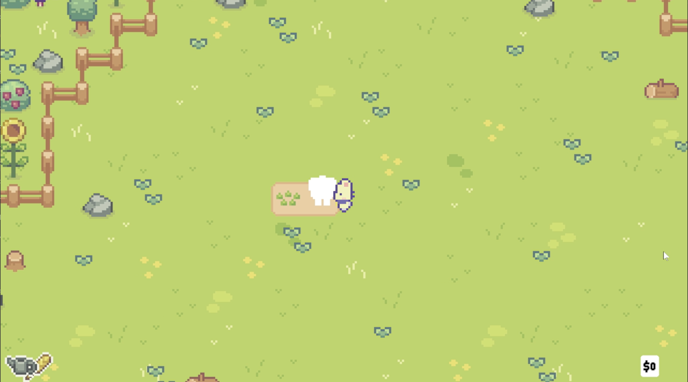

# Algorithm & Programming Final Project: Sunny Sprouts

#### Project Name: Sunny Sprouts

#### Project Type: Farming Simulator

#### Project Overview: 
A calming farming simulator that lets players to plant and harvest wheat, explore a deserted island, and collect wood & stone. Earn money by selling materials, and buying more seeds! The main objective is to create a peaceful environment for players to play and relax, while being engaging for players of all ages.

## Dependencies or Installation Steps
#### 1. Install pygame: pip install pygame
#### 2. Install pytmx: pip install pytmx
#### 3. Starting Game: Locate main.py and run to start

## Instructions to Run Code:

#### Important Keybinds
- To Open Instructions: [I]
- To Walk: [W], [A], [S], [D]
- To Use Tool: [SPACE]
- To Switch Tool: [Q]
- To Use/Plant Seed: [CTRL]
- To Open Menu: [M]
- To Scroll Down Menu: [W], [A], [S], [D]
- To Buy/Sell: [SPACE]
Please do keep in mind that to buy and sell your items, you have to have the menu opened.

#### 1. Run the "main.py" file

#### 2. Collect Wood and Stones
You can start by moving the character and make it come up to the logs and stones scattered around the deserted island. Once the character stands upon it, with the axe tool, press and hold [SPACE], the character should be able to destroy them!

To check the items you have just gotten, press M for Menu.

#### 3. Find Seeds
Initially, you start with 2 seeds, however you will be able to find more by coming up to the grass scattered around the deserted island. Although, it is programmed to be a randomized drop, so not all grass will give you seeds! 

To check the items you have just gotten, press M for Menu.

#### 4. Plant and Harvest Wheat
To plant the seeds that you got, switch your tool into a hoe by pressing the [Q] Keybind. Press [SPACE] onto an empty land. A soil tile should be created. 

Stand upon the soil tile and press [CTRL] to plant seeds. Grow them by switching your tool into a watering can. Keep watering until it is fully grown. 

When it is fully grown, move your character towards the plant. A collision should occur and that is how you collect your fully grown crops!

#### 5. Buy and Sell System
View your inventory by pressing [M] for menu. Press [SPACE] on which ever you need to buy and sell!

Enjoy your play! There is no specific order on how to play this simulator, hence take your time exploring and making money!

